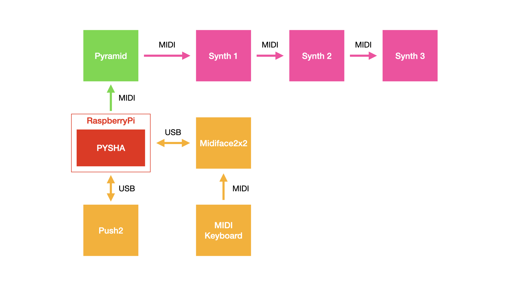
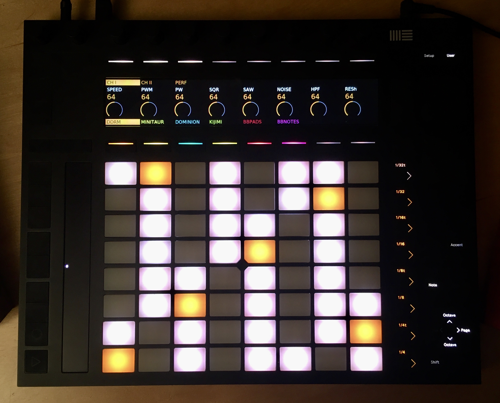
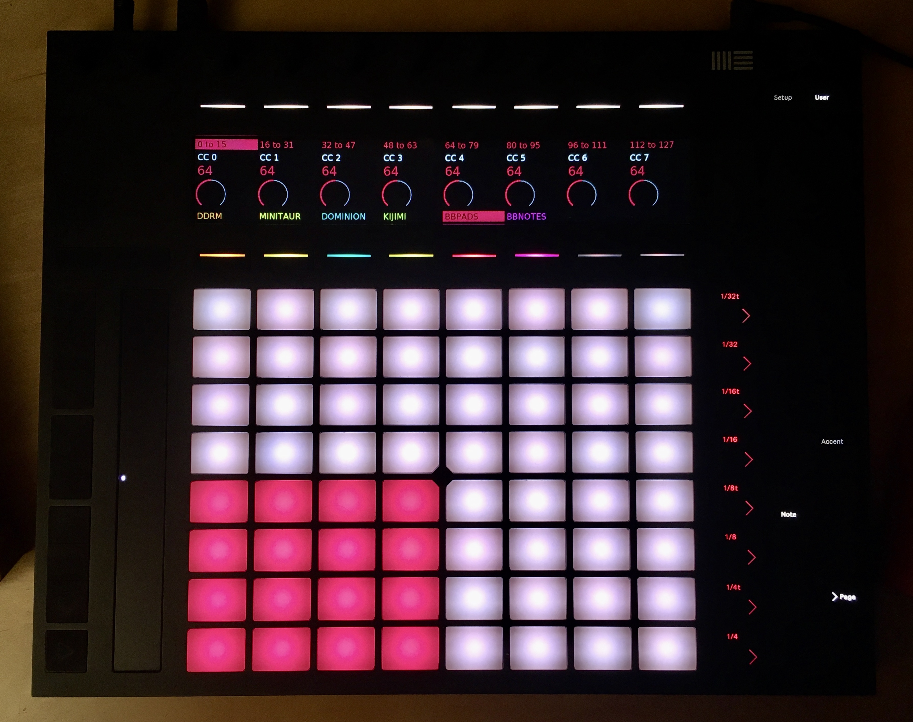
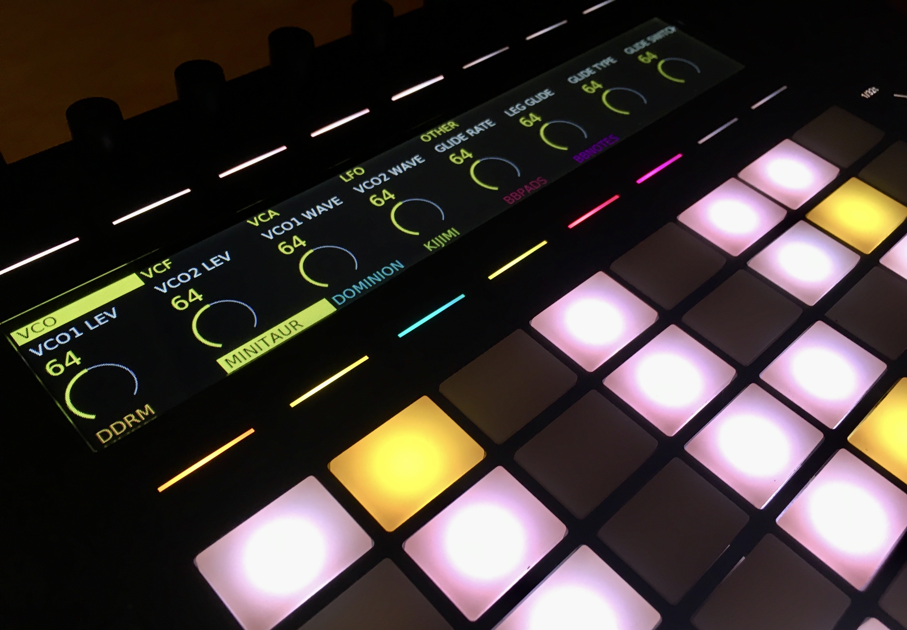
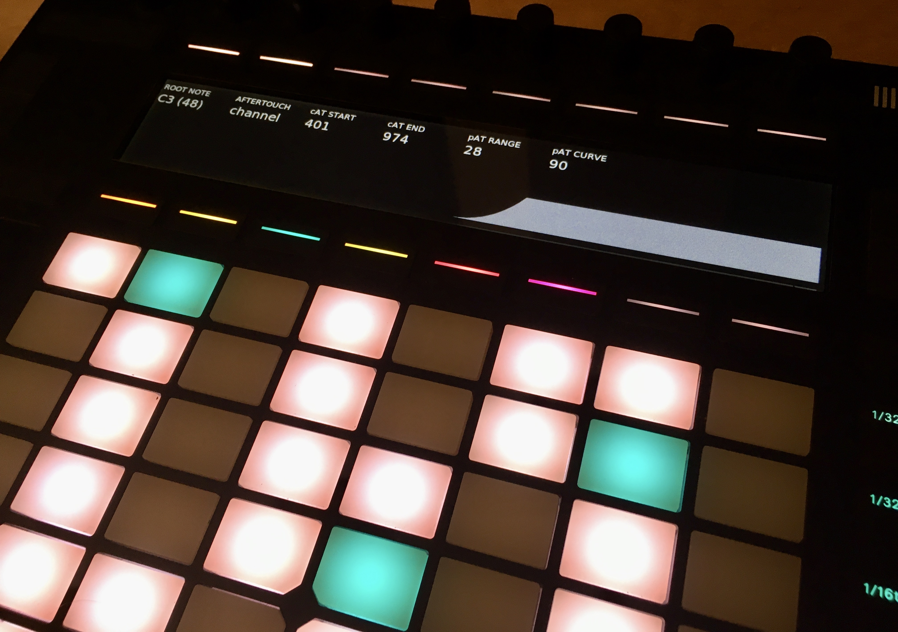

# Pysha

**Pysha** is a Python 3 app to use **Push2 as a standalone MIDI controller**. It has manily been designed to work as a controller for [Squarp's Pyramid](https://squarp.net/pyramid/), but it can also be used as a generic controller. To run Pysha, you just need to install Python requirements and run `app.py` on a computer connected to Push2 and with a MIDI interface to output messages.

```
pip install -r requirements.txt
python app.py
```

Pysha **can run on a Raspberry Pi** (see instructions below) so you can use Push2 as a standalone controller without your laptop around. Pysha is based on [push2-python](https://github.com/ffont/push2-python). `push2-python` requires [pyusb](https://github.com/pyusb/pyusb) which is based in [libusb](https://libusb.info/). You'll most probably need to manually install `libusb` for your operative system if `pip install -r requirements.txt` does not do it for you. Moreover, to draw on Push2's screen, Pysha uses [`pycairo`](https://github.com/pygobject/pycairo) Python package. You'll most probably also need to install [`cairo`](https://www.cairographics.org/) if `pip install -r requirements.txt` does not do it for you (see [this page](https://pycairo.readthedocs.io/en/latest/getting_started.html) for info on that). The name "Pysha" is some sort of blend of the names of the technologies/devices that are used.


**NOTE**: Development for Pysha as a controller for Squarp's Pyramid has been abandoned and has evolved into [Shepherd](http://github.com/ffont/shepherd), a full "Raspberry Pi + Push 2" based MIDI sequencer which does not depend on any external piece of hardware.


## Features

I designed Pysha (and I continue to update it) to serve my own specific setup needs, but hopefully it can be useful (or adapted!) to work on other setups as well. In my setup, I run Pysha on a Rapsberry Pi and connected to Push2. Push2 is used as my main source of MIDI input, and the generated MIDI is routed to a Squarp Pyramid sequencer. From there, Pyramid connects to all the other machines in the setup. Also, I have a MIDI keyboard connected to Pysha so that the notes generated from the keyboard are merges with the notes generated from Push. Below is a diagram of my setup with Pysha. These are the features that Pysha has currently implemented:

* Play melodies and chords in a chromatic scale mode
* Use classic 4x4 (and up to 8x8!) pad grid in the rhythm layout mode
* Choose between channel aftertouch and polyphonic aftertouch (note: unfortunately polyphonic aftertouch mode won't work with Pyramid)
* Use *accent* mode for fixed 127 velocity playing
* Use touchstrip as a pitch bend or modulation wheel
* Interactively adjust velocity/aftertouch sensitivity curves
* Merge MIDI in from a MIDI input (using a MIDI intergace with the Rapsberry Pi) and also send it to the main MIDI out
* Interactively configure MIDI in/out settings
* Select Pyramid tracks and show track number information on screen
* Show track instrument information and sync colors (with preloaded information about what each Pyramid track is routed to)
* Mute/unmute 64 Pyramid tracks displayed in Push2's 64 pads
* Send MIDI control CC data using the encoders, use synth definition files (much like Pyramid's) to show show controls and control names in a meaningful way
* Select track instrument presets by sending program change messages
* Temporarily disable screen rendering for slow Raspberry Pi's (like mine!)
* Save current settings so these are automatically loaded on next run
* Easy software update (provided an internet connection is working)





Here are a couple of photos of Pysha working:




*Melodic mode*



*Rhythmic mode*



*MIDI CC controls with instrument definition file*



*Interactive adjustment of aftertouch range/velocity curve*


## User manual

Well, this is not a proper user manual, but here are some notes about how to use Pysha:

 * Press `Note` button to toggle between rhythmic/melodic layouts.
 * Use `Ocateve up` and `Octave down` buttons to change octaves.
 * Press `Shift` button to toggle between pitch bend/modulation wheel modes for the touchstrip.
 * Press `Accent` button to activate fixed velocity mode (all notes will be triggered with full 127 velocity).
 * Press `Setup` button several times to cycle through configuration pages where you'll find options to:
   * Set MIDI out device and channel
   * Set MIDI in device and channel (for MIDI merge functionality)
   * Set Pyramidi MIDI channel
   * Set MIDI root note
   * Toggle between polyphonic/channel aftertouch modes
   * Configure channel pressure range and velocity/polyphonic aftertouch pad response curves
   * Save current settings to file (will be loaded automatically when Pysha runs again)
   * Run software update (to update Pysha version, requires internet connection)
   * Reset Push MIDI configuration (sometimes this is needed if not all pads are lit as expected or you see wrong button colors)
 * Select Pyramid tracks 1-8 by pressing the 8 buttons right above the pads.
 * Select Pyramid tracks 1-64 by holding one of the 8 buttons right above the pads and then pressing one of the 8 buttons to the right of pads (i.e. `1/32t`, `1/32`...).
 * Send MIDI CC messages using the 8 encoders above the display. The display will show feedback about which CC values are being sent.
 * Navigate between groups of CC controls using the 8 buttons above the display, and the `Page left`/`Page right` buttons.
 * Use instrument definition files to show proper MIDI CC control names and group them in meaningful sections. See examples in the `instrument_definitions` folder.
 * Customize Pyramid track contents editing the `track_listing.json` file. What comes by default is what I use in my setup.
 * Press `User` button to deactivate the display (useful for slow computers running Pysha).
 * Press `Add track` button to enter *Pyramid track triggering* mode (or hold the button to only momentarily activate that mode). While in this mode, you can mute/unmute the 64 Pyramid tracks using the 64 pads of the Push. Note that Pysha does not get information from Pyramid about the current status of tracks, therefore it might be out of sync with it. You can manually indicate that a track "has content" by pressing the corresponding pad, then you can mute/unmute that track by pressing the pad again. Long pressing one pad will set the corresponding track to "no content" state. In this way, you can manualy sync the track status in Pysha and the track status from Pyramid. Hopefully future Pyramid updated will allow to do this process automatically and provide tighter integration. 
 * While in *Pyramid track triggering*, use the 8 buttons on the right of pads (i.e. `1/32t`, `1/32`...) to trigger unmute of all the tracks in the selected row (that have content), and mute all other tracks. This enables a scene triggering workflow similar to that of Ableton Live.
 * Also while in *Pyramid track triggering*, hold `Master` button and press one of the track pads to select that track (and exit the track triggering mode).
 * Press `Add device` button to enter *Preset selection mode* (or hold the button to only momentarily activate that mode). While in this mode, press any of the 64 pads to send a program change message to the corresponding Pyramid track synth with values 0-63. This allows you to select one of the first 64 presets for the current bank. Long-press one of the pads to mark this preset as "favourite" and highlight it (this info is saved). Long-press again to "unfavorite" the preset. Use left and right arrows to move to the next 64 presets (64-127) and iterate through available banks.


## Instructions to get Pysha running on a RaspberryPi

These are instructions to have the script running on a Rapsberry Pi and load at startup. I'm using this with a Raspberry Pi 2 and Raspbian 2020-02-13. It works a bit slow but it works. I also tested on a Raspberry Pi 4 and it is much faster and reliable.

These instructions assume you have ssh connection with the Rpasberry Pi. Here are the instructions for [enabling ssh](https://www.raspberrypi.org/documentation/remote-access/ssh/) on the Pi. Here are instructions for [setting up wifi networks](https://www.raspberrypi.org/documentation/configuration/wireless/wireless-cli.md). Also, here are instructions for [changing the hostname](https://thepihut.com/blogs/raspberry-pi-tutorials/19668676-renaming-your-raspberry-pi-the-hostname) of the Pi so for example you can access it like `ssh pi@pysha`.

1. Install system dependencies
```
sudo apt-get update && sudo apt-get install -y libusb-1.0-0-dev libcairo2-dev python3 python3-pip git libasound2-dev libatlas-base-dev
```

2. Clone the app repository
```
git clone https://github.com/ffont/pysha.git
```

3. Install Python dependencies
```
cd pysha
pip3 install -r requirements.txt
```

4. Configure permissions for using libusb without sudo (untested with these specific commands, but should work)

Create a file in `/etc/udev/rules.d/50-push2.rules`...

    sudo nano /etc/udev/rules.d/50-push2.rules

...with these contents:

    add file contents: SUBSYSTEM=="usb", ATTR{idVendor}=="2982", ATTR{idProduct}=="1967", GROUP="audio"

Then run:

    sudo udevadm control --reload-rules
    sudo udevadm trigger


5. Configure Python script to run at startup:

Create file in `/lib/systemd/system/pysha.service`...

    sudo nano /lib/systemd/system/pysha.service

...with these contents:

```
[Unit]
Description=Pysha
After=network-online.target

[Service]
WorkingDirectory=/home/pi/pysha
ExecStart=/usr/bin/python3 /home/pi/pysha/app.py                                                
StandardOutput=syslog
User=pi
Restart=always
RestartSec=3

[Install]
WantedBy=multi-user.target
```

Set permissions to file:

    sudo chmod 644 /lib/systemd/system/pysha.service


Enable the service (and do the linger thing which really I'm not sure if it is necessary nor what it does)

    loginctl enable-linger pi
    sudo systemctl enable pysha.service

After that, the app should at startup. You can start/stop/restart and check logs running:

    sudo systemctl start|stop|restart pysha
    sudo journalctl -fu pysha
